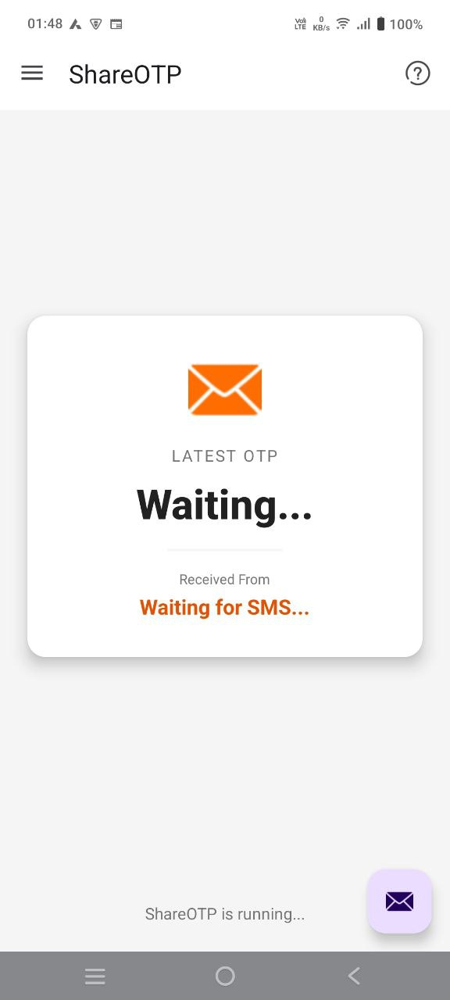
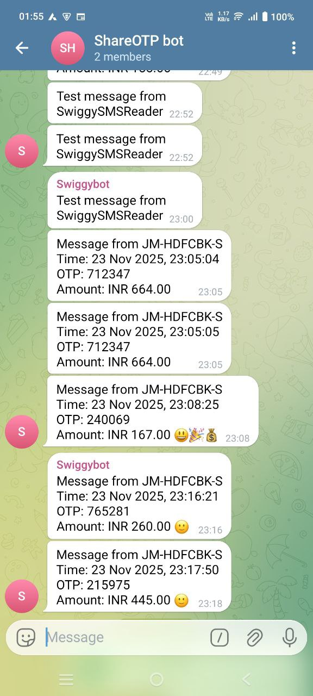
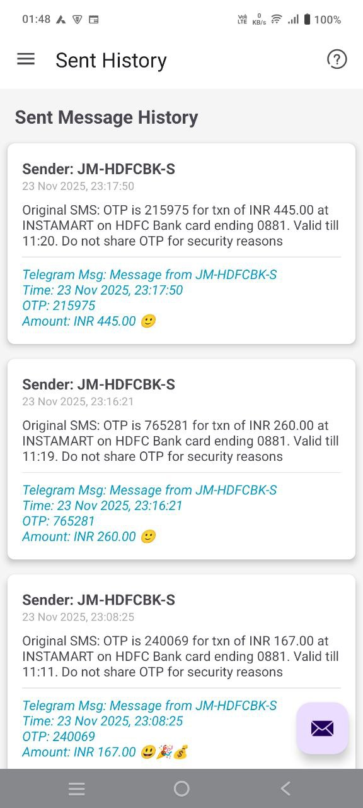

# ShareOTP (Swiggy SMS Reader)

An Android application that automatically reads SMS messages, extracts OTPs and transaction details, and forwards them to Telegram. Perfect for monitoring Swiggy orders and other OTP-based transactions.
<div align="center">
    
    
    
</div>
## Features

- 📱 **Automatic SMS Monitoring**: Receives and processes SMS messages in real-time
- 🔍 **Smart Filtering**: Filter SMS by sender name/header and message content using regex patterns
- 🔐 **OTP Extraction**: Automatically extracts 4-8 digit OTP codes from messages
- 💰 **Amount Detection**: Extracts transaction amounts from Swiggy messages (INR format)
- 📤 **Telegram Integration**: Forwards filtered messages to Telegram via bot API
- 🔒 **Secure Storage**: Uses encrypted shared preferences for storing sensitive configuration
- 📊 **History Tracking**: Maintains a history of sent messages
- ⚙️ **Background Processing**: Uses WorkManager for reliable background SMS processing
- 🎨 **Modern UI**: Material Design with navigation drawer

## Screenshots

*Add screenshots here*

## Requirements

- Android 8.0 (API level 26) or higher
- SMS permissions (READ_SMS, RECEIVE_SMS, SEND_SMS)
- Internet permission (for Telegram API)
- Telegram Bot Token and Chat ID

## Setup

### 1. Clone the Repository

```bash
git clone <repository-url>
cd SwiggySMSReader
```

### 2. Build the Project

Open the project in Android Studio and sync Gradle files. The project uses:
- Kotlin
- Gradle with Version Catalog
- AndroidX libraries
- Material Design Components

### 3. Configure Telegram Bot

1. Create a Telegram bot by messaging [@BotFather](https://t.me/botfather) on Telegram
2. Get your bot token
3. Get your chat ID (you can use [@userinfobot](https://t.me/userinfobot) or [@getidsbot](https://t.me/getidsbot))
4. Open the app and navigate to **Telegram Config** from the navigation drawer
5. Enter your bot token and chat ID
6. Click **Save** to store the configuration securely

### 4. Configure Filters (Optional)

1. Navigate to **Settings** from the navigation drawer
2. Set **Header Regex** to filter by sender (e.g., `SWIGGY` for Swiggy messages)
3. Set **Message Regex** to filter by message content
4. The app will only process SMS that match both filters (if configured)

## Usage

1. **Grant Permissions**: On first launch, grant SMS permissions when prompted
2. **Configure Telegram**: Set up your Telegram bot token and chat ID
3. **Set Filters** (Optional): Configure regex patterns to filter specific SMS
4. **Monitor**: The app will automatically:
   - Receive incoming SMS
   - Filter based on your settings
   - Extract OTP and amount (if present)
   - Send formatted message to Telegram
   - Save to history

### Message Format

Messages sent to Telegram include:
- Sender information
- Timestamp
- Extracted OTP
- Amount (if detected)
- Emojis based on amount:
  - 😡🤬💸 for amounts > ₹2000
  - 😃🎉💰 for amounts < ₹200
  - 🙂 for amounts between ₹200-₹2000

## Project Structure

```
app/src/main/java/com/example/swiggysmsreader/
├── MainActivity.kt              # Main activity with navigation drawer
├── FirstFragment.kt             # Home fragment with SMS display
├── SmsReceiver.kt               # Broadcast receiver for SMS
├── SmsWorker.kt                 # WorkManager worker for background processing
├── SmsContentObserver.kt        # Content observer for SMS changes
├── TelegramConfigFragment.kt    # Telegram bot configuration
├── SettingsFragment.kt          # App settings and filters
├── HistoryFragment.kt           # View sent message history
├── HistoryAdapter.kt            # RecyclerView adapter for history
├── TestSmsFragment.kt           # Test SMS functionality
├── HelpFragment.kt              # Help and documentation
├── SecurePreferencesManager.kt  # Encrypted shared preferences manager
└── SentHistoryManager.kt        # History management utilities
```

## Key Components

### SmsReceiver
Broadcast receiver that listens for incoming SMS and triggers background processing via WorkManager.

### SmsWorker
Background worker that:
- Filters SMS based on regex patterns
- Extracts OTP codes (4-8 digits)
- Extracts transaction amounts
- Sends formatted messages to Telegram
- Saves to history

### SecurePreferencesManager
Manages encrypted shared preferences using AndroidX Security Crypto library for secure storage of:
- Telegram bot token
- Telegram chat ID
- Filter regex patterns
- Other sensitive data

## Permissions

The app requires the following permissions:
- `RECEIVE_SMS`: To receive incoming SMS messages
- `READ_SMS`: To read SMS content
- `SEND_SMS`: For SMS functionality
- `INTERNET`: To communicate with Telegram API
- `ACCESS_NETWORK_STATE`: To check network connectivity

## Dependencies

- **AndroidX Core KTX**: Core Android extensions
- **AndroidX AppCompat**: Backward compatibility
- **Material Design**: UI components
- **AndroidX Navigation**: Navigation component
- **Gson**: JSON parsing
- **AndroidX Security Crypto**: Encrypted shared preferences
- **AndroidX Work Manager**: Background task processing

## Security

- All sensitive data (bot tokens, chat IDs) are stored using encrypted shared preferences
- No data is stored in plain text
- Network communication uses HTTPS

## Troubleshooting

### Messages not being forwarded
1. Check if SMS permissions are granted
2. Verify Telegram bot token and chat ID are correct
3. Test Telegram connection using the "Test Telegram" button
4. Check if filters are too restrictive

### OTP not extracted
- The app looks for 4-8 digit numbers in the message
- Ensure the SMS contains numeric codes in this range

### Telegram messages not received
1. Verify bot token is correct
2. Verify chat ID is correct
3. Ensure you've started a conversation with the bot
4. Check internet connectivity

## Development

### Building

#### Debug Build
```bash
./gradlew assembleDebug
```

#### Release Build
```bash
./gradlew assembleRelease
```

### Finding the Built APK

After building, you can find the APK files in:

- **Debug APK**: `app/build/outputs/apk/debug/app-debug.apk`
- **Release APK**: `app/build/outputs/apk/release/app-release.apk`

**Note**: If the APK is not in the `outputs/apk` folder, check:
- `app/build/intermediates/apk/debug/app-debug.apk` (intermediate build)

### Installing the APK

You can install the APK on your device using:

```bash
# Via ADB (Android Debug Bridge)
adb install app/build/outputs/apk/debug/app-debug.apk

# Or manually transfer the APK to your device and install it
```

### Running Tests

```bash
./gradlew test
```

## License

*Add your license here*

## Contributing

Contributions are welcome! Please feel free to submit a Pull Request.

## Author

*Add author information here*

## Acknowledgments

- Built with Android Studio
- Uses Material Design components
- Telegram Bot API for messaging

